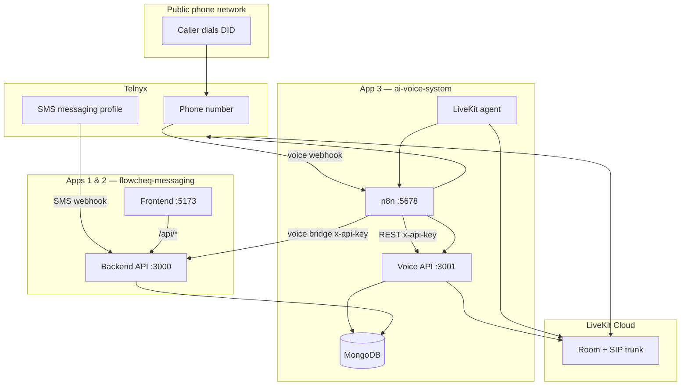
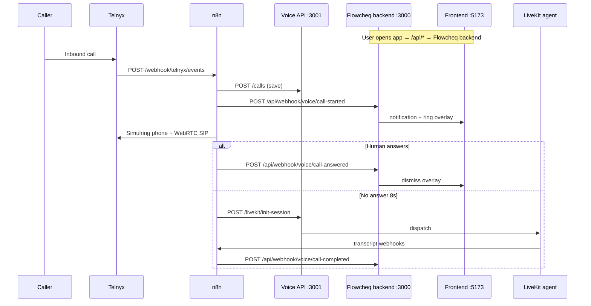
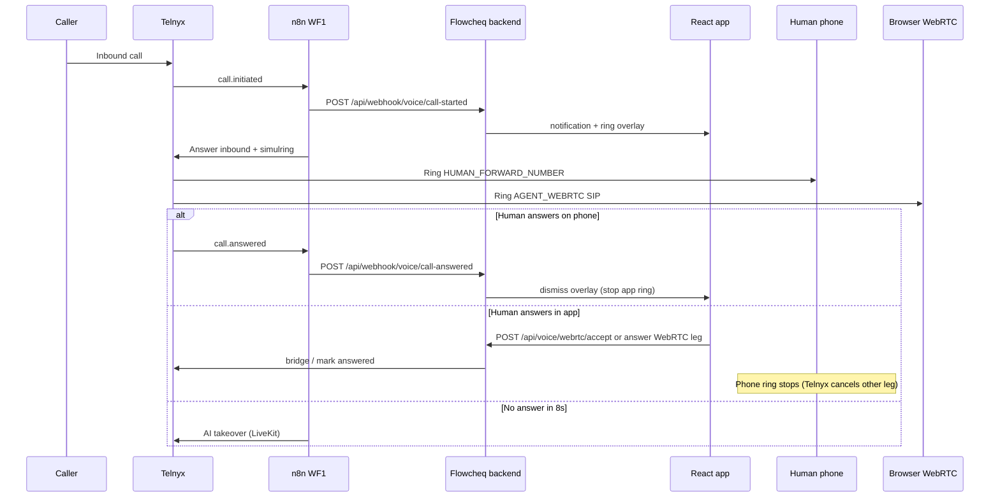

# AI Voice System — Deployment & Integration Handbook

This guide walks you through deploying **three separate apps** and wiring them together for inbound voice, SMS, and in-browser WebRTC.

| App | Repo / folder | Port (dev) | Role |
|-----|---------------|------------|------|
| **Flowcheq frontend** | `flowcheq-messaging/src/` | **5173** | React UI — calls `/api` only, no secrets |
| **Flowcheq backend** | `flowcheq-messaging/backend/` | **3000** | Express API — SMS, contacts, WebRTC tokens, MongoDB |
| **ai-voice-system** | `ai-voice-system/` | **3001** (API) | Voice gateway, n8n, LiveKit agent, shared MongoDB |

Follow **Section 4** step by step. Use the later phases for account setup details, n8n node reference, and troubleshooting.

---

## Table of contents

1. [What you are building](#1-what-you-are-building)
2. [The three apps and how they connect](#2-the-three-apps-and-how-they-connect)
3. [Prerequisites checklist](#3-prerequisites-checklist)
4. [**Step-by-step: Deploy and connect all three apps**](#4-step-by-step-deploy-and-connect-all-three-apps) ← start here
5. [Phase 1 — Accounts and credentials](#5-phase-1--accounts-and-credentials)
6. [Phase 2 — Configure environment variables](#6-phase-2--configure-environment-variables)
7. [Phase 3 — Deploy the voice stack (Docker)](#7-phase-3--deploy-the-voice-stack-docker)
8. [Phase 4 — Import and configure n8n workflows](#8-phase-4--import-and-configure-n8n-workflows)
9. [Phase 5 — Wire Telnyx](#9-phase-5--wire-telnyx)
10. [Phase 6 — LiveKit SIP and the Python agent](#10-phase-6--livekit-sip-and-the-python-agent)
11. [Phase 7 — End-to-end call test](#11-phase-7--end-to-end-call-test)
12. [Flowcheq integration reference](#12-flowcheq-integration-reference)
13. [Human-first then AI fallback](#13-human-first-then-ai-fallback)
14. [Day-to-day operations](#14-day-to-day-operations)
15. [Troubleshooting](#15-troubleshooting)
16. [Quick reference](#16-quick-reference)

---

## 1. What you are building

When someone dials your business phone number:

1. **Telnyx** receives the PSTN call and sends a webhook.
2. **Node API** (`server.js`) acknowledges the webhook in under 300ms and forwards the event to **n8n**.
3. **Workflow 1** decides: send the call to a human, or to the **AI receptionist**.
4. On the AI path, the API creates a **LiveKit** room, bridges audio over SIP, and the **Python agent** talks to the caller (STT → LLM → TTS).
5. During the call, transcript chunks go to **Workflow 2**, which saves them and, when the call ends, runs **GPT-4o summarization**, upserts a **lead**, and sends **Telegram** alerts.
6. If the caller asks for a human or uses urgent keywords, **Workflow 3** escalates: marks the call, transfers via Telnyx, and alerts the team.

The **Flowcheq frontend** never holds secrets. It talks only to the **Flowcheq backend**. The **ai-voice-system** orchestrates Telnyx voice events via **n8n** and notifies the Flowcheq backend over HTTP webhooks (`/api/webhook/voice/*`).

---

## 2. The three apps and how they connect

### 2.1 System diagram



### 2.2 Who talks to whom

| From | To | URL / mechanism | Purpose |
|------|-----|-----------------|---------|
| **Browser** | Flowcheq backend | `GET/POST /api/*` | Inbox, SMS, calls, WebRTC token |
| **Telnyx SMS** | Flowcheq backend | `POST {APP_URL}/webhook/inbound` | Inbound text messages |
| **Telnyx voice** | n8n | `POST {N8N}/webhook/telnyx/events` | Inbound call events |
| **n8n** | Voice API | `{MONGO_API_URL}/calls`, `/transcripts`, `/livekit/init-session` | Voice DB + AI session |
| **n8n** | Flowcheq backend | `{FLOWCHEQ_API_URL}/api/webhook/voice/*` | Ring overlay, call status, summaries |
| **LiveKit agent** | n8n | transcript + escalation webhooks | Real-time AI pipeline |
| **Voice API** (optional) | n8n | forwards `/telnyx/events` | Gateway pattern — see §9 |

### 2.3 Shared configuration (must match)

| Value | Flowcheq backend `.env` | ai-voice-system `config/.env` / n8n variables |
|-------|-------------------------|-----------------------------------------------|
| MongoDB | `MONGODB_URI` | `MONGODB_URI` (same database) |
| Webhook auth | `WEBHOOK_SECRET` | `FLOWCHEQ_WEBHOOK_SECRET` (same string) |
| Telnyx account | `TELNYX_API_KEY`, `TELNYX_PHONE_NUMBER` | Same key + number (voice uses Call Control too) |
| n8n router URL | `N8N_CALL_ROUTER_WEBHOOK` | `N8N_CALL_ROUTER_WEBHOOK` (if using voice API gateway) |

### 2.4 Dev vs production URLs

| Service | Local dev | Production example |
|---------|-----------|-------------------|
| Flowcheq frontend | `http://localhost:5173` | `https://app.yourdomain.com` |
| Flowcheq backend | `http://localhost:3000` | `https://api.yourdomain.com` |
| Voice API | `http://localhost:3001` | `https://voice-api.yourdomain.com` |
| n8n webhooks | tunnel → `https://xxx.ngrok.io/webhook/...` | `https://n8n.yourdomain.com/webhook/...` |

**Port rule:** Flowcheq backend and voice API both default to 3000 — run voice API on **3001** in dev (`PORT=3001` in `config/.env`).

### 2.5 Webhook routing (Telnyx voice)

| Pattern | Telnyx Call Control webhook | Notes |
|---------|----------------------------|--------|
| **B — Direct to n8n (recommended first test)** | `https://YOUR-N8N/webhook/telnyx/events` | Works with shipped Workflow 1 |
| **A — Via voice API gateway** | `https://YOUR-VOICE-API/telnyx/events` | Requires WF1 tweak for pre-parsed events |

This handbook uses **Pattern B** for the first successful test.

---

## 3. Prerequisites checklist

Before you start, confirm you have:

- [ ] A **public HTTPS domain** (or ngrok/Cloudflare tunnel) for webhooks — Telnyx will not call `localhost` reliably in production.
- [ ] **Docker Desktop** (or Docker Engine) + Docker Compose v2.
- [ ] **Node.js 20+** (for local dev without Docker).
- [ ] **Python 3.12+** (only if running the agent outside Docker).
- [ ] Accounts created (free tiers are fine for learning):
  - [Telnyx](https://telnyx.com) — phone number + Call Control Application
  - [LiveKit Cloud](https://cloud.livekit.io)
  - [OpenAI](https://platform.openai.com) — API key with GPT-4o access
  - [Deepgram](https://deepgram.com) — STT API key
  - [ElevenLabs](https://elevenlabs.io) — TTS API key
  - [Telegram](https://core.telegram.org/bots) — bot token + your chat ID
  - MongoDB Atlas **or** use the Mongo container from `docker-compose.yml`
- [ ] Optional: SMTP (SendGrid, etc.) for email alerts in Workflow 3.

**Port conflict warning:** Flowcheq backend uses **3000**, voice API uses **3001**, frontend uses **5173**. Never run both backends on the same port.

---

## 4. Step-by-step: Deploy and connect all three apps

Complete each step and check the box before moving on. Keep a notes doc with every URL and secret.

### Step 1 — Generate shared secrets

```bash
openssl rand -hex 32   # use for WEBHOOK_SECRET and FLOWCHEQ_WEBHOOK_SECRET
openssl rand -hex 32   # use for INTERNAL_API_KEY (voice API ↔ n8n)
openssl rand -hex 32   # use for N8N_ENCRYPTION_KEY (Docker)
openssl rand -hex 16   # use for POSTGRES_PASSWORD (Docker)
```

| Secret | Where it goes |
|--------|----------------|
| Same random string | Flowcheq `WEBHOOK_SECRET` **and** voice `FLOWCHEQ_WEBHOOK_SECRET` **and** n8n variable `FLOWCHEQ_WEBHOOK_SECRET` |
| Different random string | Voice `INTERNAL_API_KEY` **and** n8n variable `INTERNAL_API_KEY` |

- [ ] Secrets generated and saved (password manager — never commit to git)

---

### Step 2 — Create third-party accounts

You need credentials from Telnyx, LiveKit, OpenAI, Deepgram, ElevenLabs, and optionally Telegram. Full portal steps are in [Phase 1](#5-phase-1--accounts-and-credentials).

- [ ] Telnyx: phone number, Call Control app, API key, Ed25519 public key
- [ ] LiveKit Cloud: API key/secret, SIP trunk
- [ ] OpenAI, Deepgram, ElevenLabs API keys
- [ ] Telegram bot (optional alerts)

---

### Step 3 — Deploy shared MongoDB

Both backends use the **same** `MONGODB_URI`.

**Option A — Docker (comes with voice stack):**

The `ai-voice-system/docker-compose.yml` starts Mongo on port `27017`. Use:

```env
MONGODB_URI=mongodb://localhost:27017/voice_calls
```

in **both** env files.

**Option B — MongoDB Atlas:**

Create a cluster, allow your server IP, copy the connection string into both env files.

- [ ] MongoDB running and reachable
- [ ] Same `MONGODB_URI` noted for Steps 4 and 6

---

### Step 4 — Deploy App 3: ai-voice-system

```bash
cd ai-voice-system
cp config/.env.example config/.env
```

Edit `config/.env` — minimum for local dev:

```env
PORT=3001
APP_BASE_URL=http://localhost:3001
INTERNAL_API_KEY=<from Step 1>
MONGODB_URI=mongodb://localhost:27017/voice_calls
MONGO_API_URL=http://localhost:3001

TELNYX_API_KEY=
TELNYX_PUBLIC_KEY=
TELNYX_PHONE_NUMBER=+15551234567
TELNYX_CONNECTION_ID=
TELNYX_WEBHOOK_BASE_URL=http://localhost:3001

LIVEKIT_HOST=wss://your-project.livekit.cloud
LIVEKIT_API_KEY=
LIVEKIT_API_SECRET=
LIVEKIT_SIP_URI=sip.livekit.cloud
LIVEKIT_SIP_TRUNK_ID=

OPENAI_API_KEY=
DEEPGRAM_API_KEY=
ELEVENLABS_API_KEY=
N8N_TRANSCRIPT_WEBHOOK_URL=https://YOUR-N8N/webhook/livekit/transcript
N8N_ESCALATION_WEBHOOK_URL=https://YOUR-N8N/webhook/livekit/escalation
N8N_CALL_ROUTER_WEBHOOK=https://YOUR-N8N/webhook/telnyx/events

FLOWCHEQ_API_URL=http://localhost:3000
FLOWCHEQ_WEBHOOK_SECRET=<same as Flowcheq WEBHOOK_SECRET>

HUMAN_FORWARD_NUMBER=+15559876543
AGENT_WEBRTC_SIP_USERNAME=
HUMAN_RING_TIMEOUT_SEC=8
HUMAN_AVAILABLE=true

N8N_ENCRYPTION_KEY=<from Step 1>
POSTGRES_PASSWORD=<from Step 1>
```

Start the stack:

```bash
docker compose up -d --build
```

Verify:

```bash
curl http://localhost:3001/health
# {"status":"ok","db":"connected",...}
```

- [ ] Voice API healthy on port **3001**
- [ ] n8n editor reachable at `http://localhost:5678` (or your tunnel URL)

---

### Step 5 — Configure n8n (connects voice ↔ Flowcheq)

n8n is the **hub** between Telnyx, the voice API, LiveKit, and the Flowcheq backend.

#### 5a. Import workflows

In n8n → **Settings → Import from file**, import from `ai-voice-system/n8n-workflows/`:

| File | Webhook path |
|------|----------------|
| `workflow-error-handler.json` | (error workflow) |
| `workflow-1-call-router.json` | `/webhook/telnyx/events` |
| `workflow-2-transcript-processor.json` | `/webhook/livekit/transcript` |
| `workflow-3-escalation.json` | `/webhook/livekit/escalation` |

#### 5b. Add n8n credentials (UI)

| Credential | Used for |
|------------|----------|
| HTTP Bearer Auth (Telnyx) | WF1/WF3 Telnyx API nodes |
| HTTP Bearer Auth (OpenAI) | WF2 summarization |
| Telegram | WF2/WF3/error alerts |
| SMTP | WF3 email (optional) |

#### 5c. Set n8n environment variables

**Settings → Variables** — add every variable workflows read as `$env.*`:

```env
TELNYX_PUBLIC_KEY
TELNYX_PHONE_NUMBER
TELNYX_CONNECTION_ID
INTERNAL_API_KEY
MONGO_API_URL=http://localhost:3001
APP_BASE_URL=http://localhost:3001
FLOWCHEQ_API_URL=http://localhost:3000
FLOWCHEQ_WEBHOOK_SECRET
HUMAN_FORWARD_NUMBER
AGENT_WEBRTC_SIP_USERNAME
HUMAN_RING_TIMEOUT_SEC=8
HUMAN_AVAILABLE=true
TELEGRAM_CHAT_ID
ALERT_FROM_EMAIL
ALERT_TO_EMAIL
```

> **Important:** The n8n Docker container does **not** auto-load `config/.env`. You must set these in n8n **Variables** or add them to the `n8n` service in `docker-compose.yml`.

#### 5d. Activate and copy webhook URLs

1. Toggle **Active** on all four workflows.
2. Open each Webhook node → copy **Production URL**.
3. Paste into `config/.env`:

```env
N8N_CALL_ROUTER_WEBHOOK=https://...
N8N_TRANSCRIPT_WEBHOOK_URL=https://...
N8N_ESCALATION_WEBHOOK_URL=https://...
```

4. Restart voice services:

```bash
docker compose restart api agent
```

- [ ] All workflows active
- [ ] Webhook URLs in `config/.env`
- [ ] n8n Variables match `config/.env`

---

### Step 6 — Deploy App 2: Flowcheq backend

In the **flowcheq-messaging** repo (separate git repo from ai-voice-system):

```bash
cd flowcheq-messaging
cp .env.example .env
```

Edit `.env`:

```env
PORT=3000
APP_URL=http://localhost:3000
FRONTEND_URL=http://localhost:5173

MONGODB_URI=mongodb://localhost:27017/voice_calls

TELNYX_API_KEY=
TELNYX_PHONE_NUMBER=+15551234567
TELNYX_CONNECTION_ID=
TELNYX_WEBRTC_CONNECTION_ID=

N8N_CALL_ROUTER_WEBHOOK=https://YOUR-N8N/webhook/telnyx/events
WEBHOOK_SECRET=<same as FLOWCHEQ_WEBHOOK_SECRET>
```

Start the API:

```bash
npm install
npm run dev:backend
```

Verify:

```bash
curl http://localhost:3000/api/health
# {"status":"ok","db":"connected",...}
```

- [ ] Backend healthy on port **3000**
- [ ] `WEBHOOK_SECRET` matches voice stack / n8n

---

### Step 7 — Deploy App 1: Flowcheq frontend

The frontend has **no `.env` file**. It calls `/api` only.

```bash
# same repo, second terminal
npm run dev:frontend
```

Open `http://localhost:5173`. Vite proxies `/api` → `http://localhost:3000`.

**Production:** build static files and put a reverse proxy in front:

```bash
npm run build:frontend          # outputs dist/
# Serve dist/ at https://app.yourdomain.com
# Proxy /api → https://api.yourdomain.com
```

- [ ] Frontend loads at **5173**
- [ ] API calls succeed (open browser devtools → Network → `/api/health`)

---

### Step 8 — Wire Telnyx to both backends

Use the **same Telnyx number** for SMS and voice, but **different webhook URLs**:

| Telnyx product | Webhook URL | App |
|----------------|-------------|-----|
| **Messaging profile** (SMS) | `https://YOUR-FLOWCHEQ-API/webhook/inbound` | Flowcheq backend |
| **Call Control application** (voice) | `https://YOUR-N8N/webhook/telnyx/events` | n8n (WF1) |

Telnyx portal checklist:

- [ ] Call Control app: API v2, POST, HTTPS
- [ ] Events enabled: `call.initiated`, `call.answered`, `call.hangup`
- [ ] Number assigned to Call Control app
- [ ] SMS profile webhook points at Flowcheq backend `APP_URL`

Test: send an SMS to your number → should appear in Flowcheq inbox.

---

### Step 9 — Configure WebRTC simulring (phone + app ring together)

Dual ring requires a Telnyx **WebRTC credential** on the Flowcheq backend and the SIP username in the voice stack.

1. In Telnyx portal, create a **Credential Connection** → copy Connection ID → Flowcheq `TELNYX_WEBRTC_CONNECTION_ID`.
2. Start Flowcheq frontend + backend. Open the app (or call `GET http://localhost:3000/api/voice/webrtc/token`).
3. In Telnyx → **Telephony Credentials**, copy the `sip_username`.
4. Set in **three places**:
   - Flowcheq backend: credential is auto-created (cached in `backend/data/webrtc_credential.json`)
   - `ai-voice-system/config/.env`: `AGENT_WEBRTC_SIP_USERNAME=<sip_username>`
   - n8n Variables: `AGENT_WEBRTC_SIP_USERNAME=<sip_username>`
5. Restart n8n workflows if needed.

- [ ] `GET /api/voice/webrtc/status` returns enabled
- [ ] `AGENT_WEBRTC_SIP_USERNAME` set in voice `.env` and n8n

---

### Step 10 — Verify the full connection chain

#### Health checks

```bash
curl http://localhost:3001/health          # voice API
curl http://localhost:3000/api/health      # Flowcheq backend
curl http://localhost:3000/api/voice/webrtc/status
```

#### Inbound call (dual ring)

1. Call your Telnyx number from a mobile phone.
2. Expected within 2 seconds:
   - [ ] n8n WF1 execution starts
   - [ ] `HUMAN_FORWARD_NUMBER` phone rings
   - [ ] Flowcheq app shows incoming-call overlay
3. Answer on **phone** → app overlay dismisses within ~4s.
4. Call again → tap **Answer in App** → WebRTC audio works; phone stops ringing.

#### AI fallback

1. Call again; do **not** answer for 8 seconds.
2. Expected:
   - [ ] AI greeting (LiveKit agent)
   - [ ] After hangup: WF2 summary → Flowcheq Calls tab updated

#### SMS

1. Text your Telnyx number.
2. Expected: message appears in Flowcheq inbox.

---

### Step 11 — Production deployment checklist

| App | Deploy as | Public URL |
|-----|-----------|------------|
| Flowcheq frontend | Static files (CDN/nginx) | `https://app.yourdomain.com` |
| Flowcheq backend | Node process / container | `https://api.yourdomain.com` |
| Voice API | Docker `api` service | `https://voice-api.yourdomain.com` |
| n8n | Docker `n8n` service | `https://n8n.yourdomain.com` |
| LiveKit agent | Docker `agent` service | (outbound to LiveKit Cloud only) |

Update env files with production HTTPS URLs:

| Variable | Production value |
|----------|------------------|
| Flowcheq `APP_URL` | `https://api.yourdomain.com` |
| Flowcheq `FRONTEND_URL` | `https://app.yourdomain.com` |
| Voice `APP_BASE_URL` | `https://voice-api.yourdomain.com` |
| Voice `MONGO_API_URL` | `https://voice-api.yourdomain.com` (or internal `http://api:3000` in Docker network) |
| n8n `FLOWCHEQ_API_URL` | `https://api.yourdomain.com` |
| n8n `MONGO_API_URL` | voice API URL reachable from n8n container |
| Telnyx SMS webhook | `https://api.yourdomain.com/webhook/inbound` |
| Telnyx voice webhook | `https://n8n.yourdomain.com/webhook/telnyx/events` |

Set `docker-compose.yml` n8n `WEBHOOK_URL` to your public n8n base URL.

- [ ] All URLs use HTTPS
- [ ] CORS: Flowcheq `FRONTEND_URL` or `CORS_ORIGINS` set for production app domain
- [ ] Secrets rotated from dev values

---

### Step 12 — Connection diagram (what you just built)



When all steps pass, all three apps are deployed and connected.

---

## 5. Phase 1 — Accounts and credentials

Detailed portal steps for [Step 2](#4-step-by-step-deploy-and-connect-all-three-apps) of the deployment guide.

### Step 1.1 — Telnyx (voice)

1. Log in to the [Telnyx Mission Control Portal](https://portal.telnyx.com).
2. Buy or port a **phone number** (E.164 format, e.g. `+15551234567`).
3. Create a **Call Control Application**:
   - **Webhook URL**: leave blank until [Step 8](#step-8--wire-telnyx-to-both-backends) (n8n URL).
   - **API version**: v2.
4. Assign your number to this Call Control Application.
5. Under **API Keys**, create a key → copy to `TELNYX_API_KEY`.
6. Under **Webhooks** (or the app’s signing settings), copy the **Ed25519 public key** (base64) → `TELNYX_PUBLIC_KEY`.
7. Copy the **Connection ID** of the Call Control app → `TELNYX_CONNECTION_ID`.
8. Enable webhook events at minimum:
   - `call.initiated`
   - `call.answered`
   - `call.hangup`

### Step 1.2 — LiveKit Cloud

1. Create a project at [cloud.livekit.io](https://cloud.livekit.io).
2. Copy **API Key**, **API Secret**, and **WebSocket URL** (`wss://…`) → `LIVEKIT_API_KEY`, `LIVEKIT_API_SECRET`, `LIVEKIT_HOST`.
3. Open **SIP** → create an **Inbound trunk**:
   - Note the **SIP URI host** (e.g. `sip.livekit.cloud`) → `LIVEKIT_SIP_URI` (host only, no `sip:` prefix).
   - Note **Trunk ID** → `LIVEKIT_SIP_TRUNK_ID`.
4. In trunk settings, allow **Telnyx** as an origination provider (add Telnyx SIP IPs/hostnames per LiveKit docs for your region).

### Step 1.3 — AI providers

| Variable | Where to get it |
|----------|-----------------|
| `OPENAI_API_KEY` | OpenAI dashboard → API keys |
| `DEEPGRAM_API_KEY` | Deepgram console → API keys |
| `ELEVENLABS_API_KEY` | ElevenLabs profile → API key |
| `ELEVENLABS_VOICE_ID` | ElevenLabs → Voices → copy voice ID (default in `.env.example` is Rachel) |

### Step 1.4 — Telegram

1. Message [@BotFather](https://t.me/BotFather) → `/newbot` → copy **token** → add as **Telegram credential** in n8n (not in `.env`).
2. Get your **chat ID**: message the bot, then open  
   `https://api.telegram.org/bot<TOKEN>/getUpdates`  
   and read `chat.id` → `TELEGRAM_CHAT_ID`.

### Step 1.5 — Internal API key

Generate a random secret used by n8n to call `server.js`:

```bash
openssl rand -hex 32
```

Save as `INTERNAL_API_KEY`. **Never commit this to git.**

---

## 6. Phase 2 — Configure environment variables

### Step 2.1 — Create the env file

```bash
cd ai-voice-system
cp config/.env.example config/.env
```

Edit `config/.env` and fill **every** value. Use this map:

| Variable | What to put |
|----------|-------------|
| `APP_BASE_URL` | Public URL of voice API, e.g. `https://voice-api.yourdomain.com` |
| `MONGO_API_URL` | Same host as voice API for n8n → `http://api:3000` inside Docker, or public URL |
| `TELNYX_WEBHOOK_BASE_URL` | Usually same as `APP_BASE_URL` |
| `N8N_CALL_ROUTER_WEBHOOK` | Full n8n URL after import — e.g. `https://n8n.yourdomain.com/webhook/telnyx/events` |
| `N8N_TRANSCRIPT_WEBHOOK_URL` | `https://n8n.yourdomain.com/webhook/livekit/transcript` |
| `N8N_ESCALATION_WEBHOOK_URL` | `https://n8n.yourdomain.com/webhook/livekit/escalation` |
| `HUMAN_AVAILABLE` | `false` = AI answers; `true` = forward to human on ring |
| `HUMAN_FORWARD_NUMBER` | E.164 mobile/desk of on-call person |

### Step 2.2 — Docker-only extras

Add to `config/.env` before `docker compose up`:

```bash
N8N_ENCRYPTION_KEY=<openssl rand -hex 32>
POSTGRES_PASSWORD=<openssl rand -hex 16>
```

### Step 2.3 — Same Telnyx number as SMS (optional)

If the messaging app already sends SMS via Telnyx (`TELNYX_API_KEY` in backend `.env`), you may reuse the **same API key**. Voice still needs **Call Control** configuration on that number. SMS webhooks (`/webhook/inbound` on the backend API) and voice webhooks are **different URLs**.

---

## 7. Phase 3 — Deploy the voice stack (Docker)

### Step 3.1 — Build and start

From `ai-voice-system/`:

```bash
docker compose up -d --build
```

This starts:

| Service | Role |
|---------|------|
| `api` | Express gateway + Mongo REST |
| `agent` | Python LiveKit worker (2 replicas by default) |
| `mongo` | MongoDB 7 |
| `n8n` | Workflow engine on port **5678** |
| `postgres` | n8n persistence |

### Step 3.2 — Verify health

```bash
curl https://YOUR-VOICE-API/health
```

Expected:

```json
{"status":"ok","db":"connected","uptime":...}
```

If `db` is `disconnected`, fix `MONGODB_URI` or wait for the mongo container healthcheck.

### Step 3.3 — Expose services securely

For production, put **HTTPS** in front of:

- Voice API (`api:3000`) — Telnyx + optional public REST
- n8n (`n8n:5678`) — webhook targets; protect the editor with auth

Update `docker-compose.yml` `WEBHOOK_URL` under the `n8n` service to your public n8n base URL (no trailing slash).

### Step 3.4 — Scale agents for concurrent calls

```bash
docker compose up -d --scale agent=4
```

Rule of thumb: **one agent replica per 2–3 simultaneous calls**, then load-test.

### Step 3.5 — Manual dev mode (no Docker)

Terminal 1 — API:

```bash
cd ai-voice-system
npm install
node server.js
```

Terminal 2 — Agent:

```bash
cd ai-voice-system/livekit-agent
pip install -r requirements.txt
python agent_worker.py dev
```

Run n8n via Docker or [n8n Cloud](https://n8n.io) and import workflows there.

---

## 8. Phase 4 — Import and configure n8n workflows

### Step 4.1 — Open n8n

- Docker: `http://localhost:5678` (or your tunnel URL).
- Complete owner account setup on first launch.

### Step 4.2 — Import workflow files (in order)

**Settings → Import from file**, import each file from `ai-voice-system/n8n-workflows/`:

| File | Name | Webhook path |
|------|------|----------------|
| `workflow-error-handler.json` | Error handler | (sub-workflow) |
| `workflow-1-call-router.json` | Call Router | `POST /webhook/telnyx/events` |
| `workflow-2-transcript-processor.json` | Transcript Processor | `POST /webhook/livekit/transcript` |
| `workflow-3-escalation.json` | Escalation | `POST /webhook/livekit/escalation` |

### Step 4.3 — Configure n8n credentials

In each workflow, nodes marked with authentication need credentials:

| Credential type | Used for |
|-----------------|----------|
| **HTTP Bearer Auth** (Telnyx) | Answer, transfer, bridge nodes → Telnyx API key |
| **HTTP Bearer Auth** (OpenAI) | Summarization node in WF2 |
| **Telegram** | Notification nodes in WF2 and WF3 |
| **SMTP** | High-priority email in WF3 (if enabled) |

### Step 4.4 — Set n8n environment variables

**Settings → Variables** (or inject via Docker env), mirror your `config/.env`:

- `TELNYX_PUBLIC_KEY`, `TELNYX_PHONE_NUMBER`, `HUMAN_FORWARD_NUMBER`, `HUMAN_AVAILABLE`
- `MONGO_API_URL`, `INTERNAL_API_KEY`, `APP_BASE_URL`
- `TELEGRAM_CHAT_ID`

n8n Code nodes read these as `$env.VARIABLE_NAME`.

### Step 4.5 — Copy production webhook URLs

Open each workflow’s **Webhook** node → copy **Production URL**.

Paste into `config/.env`:

```env
N8N_CALL_ROUTER_WEBHOOK=https://...
N8N_TRANSCRIPT_WEBHOOK_URL=https://...
N8N_ESCALATION_WEBHOOK_URL=https://...
```

Restart the `api` and `agent` containers so the agent picks up transcript/escalation URLs:

```bash
docker compose restart api agent
```

### Step 4.6 — Activate workflows

Toggle **Active** on all four workflows. Inactive workflows return 404 on webhooks.

### Step 4.7 — What each workflow does (node-by-node)

#### Workflow 1 — Call Router (`telnyx/events`)

1. **Telnyx Webhook** — receives POST from Telnyx Call Control.
2. **Verify & Parse Webhook** — Ed25519 signature + timestamp check; outputs `call_session_id`, `call_control_id`, `caller_number`.
3. **Event routing**:
   - **`call.initiated`** → save call, notify Flowcheq, **simulring** human phone + WebRTC agent, wait, AI fallback if unanswered.
   - **`call.answered`** → if not yet AI-handled, notify Flowcheq to **stop in-app ring** (human picked up on phone).
   - **`call.hangup`** → if human-handled, notify Flowcheq call completed.
4. **Simulring (human-first)**:
   - Answer inbound call (caller on hold).
   - Create outbound leg to `HUMAN_FORWARD_NUMBER` with `link_to` inbound.
   - Create outbound leg to `sip:AGENT_WEBRTC_SIP_USERNAME@sip.telnyx.com` with `link_to` inbound.
   - **First leg to answer wins** — Telnyx cancels the other ring automatically.
   - Flowcheq app also shows overlay + ringtone via `call-started` webhook.
5. **AI fallback** (after `HUMAN_RING_TIMEOUT_SEC`, default 8s):
   - If inbound not answered → answer + LiveKit init + SIP bridge → PATCH `ai_handled`.

#### Workflow 2 — Transcript Processor (`livekit/transcript`)

1. **Webhook** — receives payloads from `agent_worker.py`.
2. **Parse Event Type** — `call_ended` vs chunk.
3. **Chunk path** — `POST /transcripts` (save line).
4. **End path** — `GET /transcripts/:call_id` → OpenAI JSON summary → PATCH `/calls/:id` → POST `/leads` → Telegram.

#### Workflow 3 — Escalation (`livekit/escalation`)

1. **Webhook** — escalation payload from agent.
2. **Evaluate Escalation** — priority + alert text.
3. **Mark Call Escalated** — PATCH `/calls/:id`.
4. **Transfer to Human** — Telnyx transfer (may use `call_control_id`; verify against your payload in testing).
5. **Telegram** (+ email for high priority) — team alert.
6. **PATCH lead** — high priority status.

#### Workflow 4 — Error handler

Linked as `errorWorkflow` in settings; sends alerts when nodes fail.

### Step 4.8 — What n8n does in this project (plain language)

n8n is the orchestrator between Telnyx, LiveKit, OpenAI, MongoDB, Telegram, and the messaging app bridge.

- It receives call events from Telnyx and decides routing.
- It triggers your internal API to create LiveKit sessions.
- It stores transcript chunks and runs post-call summarization.
- It handles real-time escalation to human agents.
- It can push finalized call records into `flowcheq-messaging` so the Calls tab shows AI-handled calls.

Without n8n, you would need to write and maintain all of this orchestration logic in backend code.

---

## 9. Phase 5 — Wire Telnyx

### Step 5.1 — Choose webhook URL

**First-time setup (shipped workflows):**

Set Telnyx Call Control Application webhook to:

```text
https://YOUR-N8N-DOMAIN/webhook/telnyx/events
```

**Production gateway (after WF1 accepts parsed events):**

```text
https://YOUR-VOICE-API-DOMAIN/telnyx/events
```

and set `N8N_CALL_ROUTER_WEBHOOK` to the n8n production URL so `server.js` can forward.

### Step 5.2 — Telnyx portal checklist

- [ ] Webhook API version: **v2**
- [ ] Method: **POST**
- [ ] HTTPS only
- [ ] Number assigned to this Call Control Application
- [ ] Events enabled (see Phase 1)

### Step 5.3 — Test webhook delivery

Place a test call. In n8n → **Executions**, you should see Workflow 1 start within 1–2 seconds.

If nothing appears:

- Confirm workflow is **Active**
- Confirm `WEBHOOK_URL` in n8n Docker env matches what Telnyx calls
- Check Telnyx **Webhook Deliveries** for HTTP status codes

---

## 10. Phase 6 — LiveKit SIP and the Python agent

### Step 9.1 — Confirm agent is running

```bash
docker compose logs -f agent
```

You should see the LiveKit worker connecting to `LIVEKIT_HOST`. On dispatch, logs show:

```text
Agent started — call_id=... caller=+1...
```

### Step 9.2 — What `POST /livekit/init-session` does

Called by n8n (AI path only). Implementation: `livekit-agent/index.js` → `initializeCallSession()`.

1. Creates room `call-{call_id}`.
2. Creates SIP dispatch rule on your trunk.
3. Dispatches worker named `LIVEKIT_AGENT_NAME` (default `ai-receptionist`).
4. Returns `sip_uri` for Telnyx bridge (e.g. `sip:call-xxx@sip.livekit.cloud`).

Request:

```http
POST /livekit/init-session
x-api-key: YOUR_INTERNAL_API_KEY
Content-Type: application/json

{"call_id":"<call_session_id>","caller_number":"+1555..."}
```

### Step 9.3 — Agent audio pipeline

File: `livekit-agent/agent_worker.py`

| Stage | Provider | Config |
|-------|----------|--------|
| VAD | Silero | bundled |
| STT | Deepgram | `nova-2-phonecall` |
| LLM | OpenAI | `gpt-4o` |
| TTS | ElevenLabs | `eleven_turbo_v2` |

On each spoken line, the agent POSTs to `N8N_TRANSCRIPT_WEBHOOK_URL`. On escalation phrases, it POSTs to `N8N_ESCALATION_WEBHOOK_URL`. On hangup, it sends `event_type: call_ended` to the transcript webhook.

### Step 9.4 — Agent name must match

`LIVEKIT_AGENT_NAME` in `.env` must match the `agent_name` in `dispatchAgent()` and the worker registration in `agent_worker.py` (`WorkerOptions` / CLI). Default: `ai-receptionist`.

---

## 11. Phase 7 — End-to-end call test

Use this script as a QA checklist.

### Test A — AI answers

1. Set `HUMAN_AVAILABLE=false`.
2. Call your Telnyx number from a mobile phone.
3. Expected:
   - [ ] n8n WF1 execution succeeds
   - [ ] You hear the AI greeting within ~3 seconds
   - [ ] MongoDB `calls` has status `ai_handled`
4. Talk for 30 seconds; hang up.
5. Expected:
   - [ ] WF2 runs summarization
   - [ ] `calls` status `completed` with `summary` and `lead_score`
   - [ ] `leads` collection has caller phone
   - [ ] Telegram summary message received

### Test B — Human routing

1. `PUT /availability` or set `HUMAN_AVAILABLE=true`:

```bash
curl -X PUT "https://YOUR-VOICE-API/availability" \
  -H "x-api-key: YOUR_INTERNAL_API_KEY" \
  -H "Content-Type: application/json" \
  -d '{"available": true}'
```

2. Call again → should ring `HUMAN_FORWARD_NUMBER` without AI.

### Test C — Escalation

1. Set AI mode. During a call, say *“I need to speak to a human.”*
2. Expected:
   - [ ] WF3 execution
   - [ ] Call transferred to `HUMAN_FORWARD_NUMBER`
   - [ ] Telegram escalation alert

### Inspect MongoDB (voice)

```javascript
db.calls.find().sort({ start_time: -1 }).limit(5)
db.call_transcripts.find({ call_id: "YOUR_SESSION_ID" })
db.leads.find().sort({ last_contacted: -1 }).limit(5)
```

---

## 12. Flowcheq integration reference

This section expands on [Section 4 Steps 6–9](#4-step-by-step-deploy-and-connect-all-three-apps) — how the Flowcheq frontend and backend connect to the voice stack.

### 12.1 — Inbound call sequence



| Component | Location | Role |
|-----------|----------|------|
| Express backend | `backend/src/` | SMS, calls CRUD, voice webhooks, WebRTC token, all secrets |
| React frontend | `src/` | Inbox, Calls tab, incoming overlay, WebRTC call UI — `/api` only |
| Dev proxy | `vite.config.ts` | Proxies `/api` from `:5173` → backend `:3000` |
| Voice bridge | `backend/src/services/voiceBridgeService.ts` | Maps n8n payloads → contacts, calls, notifications |

### 12.2 — Run both Flowcheq apps

**Messaging app (repo root):**

```bash
npm install
cp .env.example .env   # backend secrets only — frontend has no .env
npm run dev            # backend :3000 + frontend :5173
```

Or separately: `npm run dev:backend` and `npm run dev:frontend`.

**Voice stack:**

```bash
cd ai-voice-system
docker compose up -d --build   # or PORT=3001 node server.js
```

Set `FLOWCHEQ_API_URL` in `ai-voice-system/config/.env` to your messaging app URL (e.g. `http://localhost:3000` for local dev).

### 12.3 — Flowcheq backend `.env`

Copy `.env.example` → `.env`. See [Step 6](#step-6--deploy-app-2-flowcheq-backend):

```env
PORT=3000
APP_URL=http://localhost:3000
FRONTEND_URL=http://localhost:5173
MONGODB_URI=mongodb://localhost:27017/voice_calls
TELNYX_API_KEY=
TELNYX_PHONE_NUMBER=+15551234567
TELNYX_CONNECTION_ID=
TELNYX_WEBRTC_CONNECTION_ID=
N8N_CALL_ROUTER_WEBHOOK=https://YOUR-N8N/webhook/telnyx/events
WEBHOOK_SECRET=                    # Same as FLOWCHEQ_WEBHOOK_SECRET in n8n
```

After first WebRTC token request, note the agent `sip_username` from Telnyx (or `backend/data/webrtc_credential.json`) and set **`AGENT_WEBRTC_SIP_USERNAME`** in the voice-system `.env` so n8n can simulring the browser.

### 12.4 — n8n → Flowcheq webhooks

All use header `x-api-key: {FLOWCHEQ_WEBHOOK_SECRET}`.

| Event | n8n node | Flowcheq endpoint | Effect |
|-------|----------|---------------------|--------|
| Inbound call starts | Notify Flowcheq: Call Started | `POST /api/webhook/voice/call-started` | Creates contact/call (`ringing`), in-app ring overlay |
| Human answered (phone) | Notify Flowcheq: Human Answered (event) | `POST /api/webhook/voice/call-answered` | Sets call `in-progress`, **dismisses app ring** |
| Human answered (timeout path) | Notify Flowcheq: Human Answered (timeout path) | same | Same dismiss behavior |
| AI call completed | WF2 bridge node | `POST /api/webhook/voice/call-completed` | Summary, transcript, lead score on call record |
| AI escalation | WF3 | `POST /api/webhook/voice/escalation` | Escalation overlay + simulring (if configured) |

### 12.5 — In-app voice (WebRTC)

Implemented in `src/context/TelnyxVoiceContext.tsx` using `@telnyx/webrtc`.

| Action | How |
|--------|-----|
| **Inbound — answer in app** | Tap **Answer in App** on overlay, or answer the WebRTC invite if simulring is active |
| **Inbound — answer on phone** | Pick up `HUMAN_FORWARD_NUMBER`; app overlay auto-dismisses via `call-answered` webhook |
| **Outbound — call back** | Phone icon in chat header → `client.newCall()` via WebRTC (falls back to REST if WebRTC not configured) |
| **During call** | Mute, hang up, timer in `ChatWindow` overlay |

Backend routes (`/api/voice/webrtc/*`):

- `GET /webrtc/status` — is WebRTC configured?
- `GET /webrtc/token` — JWT for TelnyxRTC client
- `POST /webrtc/accept` — bridge PSTN caller to browser (fallback when simulring SIP not used)
- `POST /webrtc/call-answered` — mark call in-progress, dismiss duplicate rings
- `POST /webrtc/outbound-started` / `call-ended` — log WebRTC sessions

### 12.6 — Dual ring: phone + app, first answer wins

**Requirement:** Human phone and Flowcheq app ring together; answering on either stops the other.

**How it works:**

1. n8n **does not** use a single transfer to the human phone anymore.
2. It **answers** the inbound call, then creates **two outbound legs** linked to the caller (`link_to` = inbound `call_control_id`):
   - Leg A → `HUMAN_FORWARD_NUMBER` (PSTN mobile/desk)
   - Leg B → `sip:{AGENT_WEBRTC_SIP_USERNAME}@sip.telnyx.com` (browser WebRTC)
3. Telnyx rings both; **whichever is answered first** bridges to the caller and cancels the other leg.
4. Flowcheq overlay rings in parallel (visual + Web Audio tone) for CRM context.
5. If human answers on **phone**, Telnyx fires `call.answered` → n8n → Flowcheq `call-answered` → overlay dismissed.
6. If human answers in **app**, WebRTC leg connects → overlay dismissed; phone stops ringing via Telnyx.

**Required env (voice-system / n8n):**

```env
HUMAN_FORWARD_NUMBER=+234...          # Your mobile — must be E.164
AGENT_WEBRTC_SIP_USERNAME=           # From Telnyx telephony credential (see messaging WebRTC setup)
HUMAN_RING_TIMEOUT_SEC=8             # Seconds before AI fallback
TELNYX_CONNECTION_ID=                # Used for outbound simulring legs
```

### 12.7 — SMS + voice on same Telnyx account

| Feature | Webhook URL | Handler |
|---------|-------------|---------|
| Inbound SMS | `https://APP/webhook/inbound` | `backend/src/routes/webhooks.ts` |
| Inbound call | `https://N8N/webhook/telnyx/events` | n8n Workflow 1 |

Same `TELNYX_API_KEY` and often the same DID; different Telnyx products (Messaging vs Call Control).

### 12.8 — Verify in the UI

1. Start messaging app → ensure WebRTC status is enabled (`GET /api/voice/webrtc/status`).
2. Place inbound test call → **phone rings** and **app shows full-screen overlay**.
3. Answer on **phone** → app overlay should disappear within ~4s (poll + webhook).
4. Call again → tap **Answer in App** → talk in browser; phone should stop ringing.
5. Let call ring 8s without answering → AI should take over (LiveKit).
6. After AI call ends → Calls tab shows summary/transcript (via WF2 bridge).

---

## 13. Human-first then AI fallback

**Status: implemented** in `workflow-1-call-router.json` with dual simulring (phone + WebRTC app).

### 12.1 — Call flow summary

1. Caller dials your Telnyx DID.
2. n8n WF1 receives `call.initiated`.
3. Call saved to voice MongoDB; Flowcheq notified (`call-started`) → **app rings**.
4. Inbound call answered; **simulring** starts:
   - Human phone (`HUMAN_FORWARD_NUMBER`)
   - WebRTC agent SIP (`AGENT_WEBRTC_SIP_USERNAME`)
5. **First to answer** (phone or app) connects to caller; **other ring stops** (Telnyx + Flowcheq `call-answered`).
6. If **neither answers** within `HUMAN_RING_TIMEOUT_SEC` (default **8s**):
   - n8n checks inbound call state
   - If still not answered → AI path: LiveKit session + SIP bridge
7. During AI call: transcripts → WF2 → summary, lead, Telegram, Flowcheq `call-completed`.
8. Escalation mid-call → WF3 → human simulring + Flowcheq escalation overlay.

### 12.2 — Workflow 1 node map (current)

| Node | Purpose |
|------|---------|
| Notify Flowcheq: Call Started | App overlay + call record `ringing` |
| Answer Inbound Call | Put caller on hold before simulring |
| Simulring: Human Phone | `POST /v2/calls` → PSTN with `link_to` |
| Simulring: WebRTC Agent | `POST /v2/calls` → SIP with `link_to` |
| Wait for Human | `HUMAN_RING_TIMEOUT_SEC` |
| Get Call State | Check if bridged/answered |
| Human Answered? | yes → `human_handled`; no → AI takeover |
| Notify Flowcheq: Human Answered (event) | On `call.answered` webhook — **stop app ring** |
| Answer Call (AI) → LiveKit | AI fallback path |

### 12.3 — Environment variables

**Voice system (`ai-voice-system/config/.env`):**

```env
HUMAN_FORWARD_NUMBER=+15559876543
AGENT_WEBRTC_SIP_USERNAME=your_sip_username_from_telnyx
HUMAN_RING_TIMEOUT_SEC=8
TELNYX_CONNECTION_ID=...
FLOWCHEQ_API_URL=https://your-messaging-app.com
FLOWCHEQ_WEBHOOK_SECRET=...
```

**Messaging app (repo root `.env`):**

```env
TELNYX_WEBRTC_CONNECTION_ID=...
WEBHOOK_SECRET=...    # must match FLOWCHEQ_WEBHOOK_SECRET
```

**Finding `AGENT_WEBRTC_SIP_USERNAME`:**

1. Start messaging app with `TELNYX_WEBRTC_CONNECTION_ID` set.
2. Open app (WebRTC client connects) or call `GET /api/voice/webrtc/token`.
3. Copy `sip_username` from Telnyx portal → Telephony Credentials, or from `backend/data/webrtc_credential.json`.
4. Paste into voice-system `.env` as `AGENT_WEBRTC_SIP_USERNAME`.
5. Re-import / reactivate WF1 in n8n.

### 12.4 — Escalation (Workflow 3)

When AI transfers to human:

- WF3 notifies Flowcheq (`/api/webhook/voice/escalation`) → escalation overlay in app.
- Telnyx transfer to `HUMAN_FORWARD_NUMBER` (configure simulring on escalation similarly if needed).

Ensure escalation payload includes `telnyx_call_control_id` for transfer URL:

`https://api.telnyx.com/v2/calls/{call_control_id}/actions/transfer`

### 12.5 — AI call → messaging app (Workflow 2)

WF2 includes **Notify Flowcheq: AI Call Completed** → `POST /api/webhook/voice/call-completed` with:

- `call_id`, `caller_number`, `duration`, `handled_by: "ai"`
- `summary`, `lead_score`, `transcript` (when available)

Flowcheq upserts the call record and creates a notification. Calls tab and contact thread show AI results.

### 12.6 — End-to-end test checklist

- [ ] Inbound call → phone rings + app overlay appears
- [ ] Answer on phone → app overlay dismisses; conversation works
- [ ] Inbound call → tap **Answer in App** → WebRTC audio; phone stops ringing
- [ ] No answer 8s → AI answers; transcript saved
- [ ] Say “I need a human” → escalation overlay + transfer
- [ ] Outbound: chat phone icon → WebRTC callback to contact
- [ ] Calls tab shows inbound/outbound history with summaries

---

## 14. Day-to-day operations

### Toggle AI vs human (API)

```bash
# AI handles all inbound
curl -X PUT "https://YOUR-VOICE-API/availability" \
  -H "x-api-key: YOUR_INTERNAL_API_KEY" \
  -H "Content-Type: application/json" \
  -d '{"available": false}'

# Forward to human
curl -X PUT "https://YOUR-VOICE-API/availability" \
  -H "x-api-key: YOUR_INTERNAL_API_KEY" \
  -H "Content-Type: application/json" \
  -d '{"available": true, "updated_by": "ops-team"}'
```

### Monitor n8n

- **Executions** — failed runs show which node broke.
- Link error workflow for Telegram/email on failures.

### Monitor containers

```bash
docker compose ps
docker compose logs -f api agent n8n
```

### Lead prioritization

```javascript
db.leads.find({ score: { $gte: 80 } }).sort({ last_contacted: -1 })
```

---

## 15. Troubleshooting

| Symptom | Likely cause | Fix |
|---------|--------------|-----|
| Telnyx webhook 401 | Wrong `TELNYX_PUBLIC_KEY` or clock skew | Re-copy Ed25519 key; sync server time (NTP) |
| n8n WF1 “Invalid signature” | Telnyx hits n8n but body was modified | Use raw body mode; or use gateway path with WF1 skip-verify branch |
| No n8n execution | Workflow inactive or wrong URL | Activate workflow; match `WEBHOOK_URL` |
| Call rings then silence | SIP bridge or trunk misconfigured | Verify `LIVEKIT_SIP_TRUNK_ID`, Telnyx allowed in LiveKit trunk |
| Agent never speaks | Agent container down or wrong `LIVEKIT_AGENT_NAME` | `docker compose logs agent`; align agent name |
| No transcript in Mongo | Agent env missing `N8N_TRANSCRIPT_WEBHOOK_URL` | Restart agent after `.env` fix |
| Summarization never runs | `call_ended` not POSTed | Check agent logs on hangup; test WF2 webhook with curl |
| Escalation no transfer | WF3 using `call_id` instead of `call_control_id` for Telnyx | Store `telnyx_call_control_id` in escalation payload from agent metadata |
| App keeps ringing after phone answer | `call.answered` webhook not reaching Flowcheq | Check n8n **Is call.answered?** branch; verify `FLOWCHEQ_API_URL` + secret |
| Phone keeps ringing after app answer | Simulring not using `link_to` | Re-import WF1; confirm both legs use same inbound `call_control_id` |
| WebRTC never rings in browser | Missing `AGENT_WEBRTC_SIP_USERNAME` | Set SIP username from Telnyx credential; keep messaging app open |
| App overlay but no WebRTC audio | Mic permission blocked | Allow microphone; check `TELNYX_WEBRTC_CONNECTION_ID` |
| Port already in use | Both servers on 3000 | Change voice `PORT` or messaging port |

### Manual webhook test (transcript)

```bash
curl -X POST "https://YOUR-N8N/webhook/livekit/transcript" \
  -H "Content-Type: application/json" \
  -d '{"call_id":"test-123","speaker":"caller","text":"Hello","timestamp":"2026-05-29T12:00:00Z"}'
```

---

## 16. Quick reference

### Voice API endpoints (all n8n-facing routes need `x-api-key`)

| Method | Path | Purpose |
|--------|------|---------|
| POST | `/telnyx/events` | Telnyx webhook (gateway) |
| POST | `/livekit/init-session` | Create room + dispatch agent |
| POST/PATCH/GET | `/calls`, `/calls/:id` | Call CRUD |
| POST/GET | `/transcripts`, `/transcripts/:id` | Transcript chunks |
| POST/PATCH | `/leads`, `/leads/:phone` | Leads |
| GET/PUT | `/availability` | Human vs AI routing |
| GET | `/health` | Health check |

### Messaging API endpoints (frontend + n8n bridge)

| Method | Path | Purpose |
|--------|------|---------|
| GET | `/api/calls` | Call history for UI |
| POST | `/api/calls` | Create call record |
| POST | `/api/calls/outbound` | REST outbound (fallback without WebRTC) |
| PUT | `/api/calls/:id/notes` | CRM notes |
| GET/POST | `/api/contacts` | Contact directory |
| POST | `/webhook/inbound` | Inbound SMS (Telnyx) |
| POST | `/api/webhook/voice/call-started` | n8n → start in-app ring |
| POST | `/api/webhook/voice/call-answered` | n8n → human answered on phone, stop app ring |
| POST | `/api/webhook/voice/call-completed` | n8n → AI/human call done + summary |
| POST | `/api/webhook/voice/escalation` | n8n → AI escalation overlay |
| GET | `/api/voice/webrtc/status` | WebRTC configured? |
| GET | `/api/voice/webrtc/token` | TelnyxRTC login token |
| POST | `/api/voice/webrtc/accept` | Bridge caller to browser |
| POST | `/api/voice/webrtc/call-answered` | Mark in-progress from app |

### Environment files (all three apps)

| File | App | Purpose |
|------|-----|---------|
| `flowcheq-messaging/.env` | Flowcheq backend | SMS, WebRTC, MongoDB, `WEBHOOK_SECRET` |
| *(none)* | Flowcheq frontend | No secrets — calls `/api` only |
| `ai-voice-system/config/.env` | Voice API + agent | Telnyx voice, LiveKit, AI keys |
| n8n **Settings → Variables** | n8n | `$env.*` used by workflows — must mirror voice `.env` bridge vars |

### Related docs

- [DEPLOYMENT.md](./DEPLOYMENT.md) — shorter ops-focused deploy guide  
- [../README.md](../README.md) — stack overview  

---

## Deployment order cheat sheet

Print this and check off as you go (full detail in [Section 4](#4-step-by-step-deploy-and-connect-all-three-apps)):

1. [ ] Generate shared secrets (`WEBHOOK_SECRET`, `INTERNAL_API_KEY`, Docker keys)
2. [ ] Create Telnyx, LiveKit, OpenAI, Deepgram, ElevenLabs accounts
3. [ ] Start MongoDB (Docker or Atlas) — same URI for both backends
4. [ ] **App 3:** `ai-voice-system` → `config/.env` → `docker compose up -d --build` → `curl :3001/health`
5. [ ] Import + activate n8n workflows; set credentials + Variables; copy webhook URLs into `.env`
6. [ ] **App 2:** Flowcheq backend → `.env` → `npm run dev:backend` → `curl :3000/api/health`
7. [ ] **App 1:** Flowcheq frontend → `npm run dev:frontend` → open `:5173`
8. [ ] Telnyx SMS webhook → Flowcheq `APP_URL/webhook/inbound`
9. [ ] Telnyx Call Control webhook → n8n `/webhook/telnyx/events`
10. [ ] Set `AGENT_WEBRTC_SIP_USERNAME` (Flowcheq WebRTC + voice `.env` + n8n Variables)
11. [ ] Test inbound call → phone + app ring → answer one → other stops
12. [ ] Test no-answer 8s → AI → summary in Flowcheq Calls tab
13. [ ] Test SMS in Flowcheq inbox
14. [ ] Production: HTTPS URLs, CORS, rotate secrets

When all steps pass, all three apps are deployed and connected.
